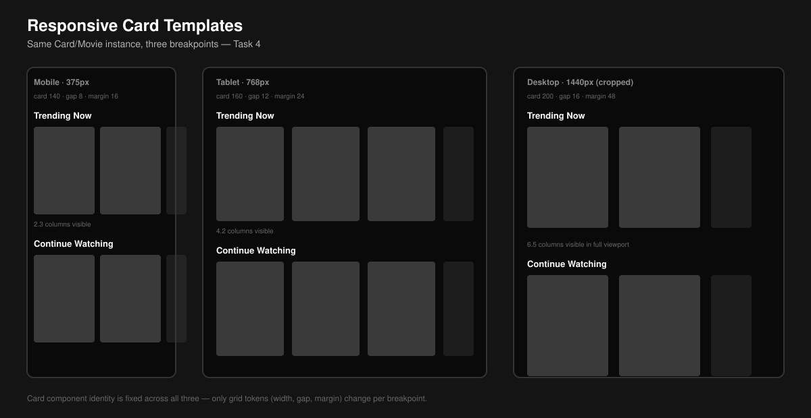

# Task 4 — Responsive Card Templates

The same `Card/Movie` component instance assembled into content rows across three breakpoints, wired together with the `Row` and `Home Screen` container components.



## What Stays Constant vs. What Changes

| | Mobile (375px) | Tablet (768px) | Desktop (1440px) |
|---|---|---|---|
| **Component identity** | `Card/Movie` | `Card/Movie` | `Card/Movie` |
| **Card internal structure** | unchanged | unchanged | unchanged |
| **Columns visible per row** | 2.3 | 4.2 | 6.5 |
| **Card width** | 140px | 160px | 200px |
| **Row gap** | 8px | 12px | 16px |
| **Grid margin** | 16px | 24px | 48px |
| **Row overflow behavior** | horizontal scroll | horizontal scroll | horizontal scroll |

The **partial card** peeking in at the row edge (the ".3", ".2", ".5" in the columns row above) is intentional — it's the same affordance Netflix uses to signal "there's more, scroll me" without a visible scrollbar.

## Assembly Hierarchy

```
Home Screen (Auto Layout, vertical, gap 32)
 └── Row (Auto Layout, horizontal, gap = breakpoint token, overflow: scroll)
      ├── Card/Movie instance
      ├── Card/Movie instance
      ├── Card/Movie instance
      └── ... (as many as content requires)
```

Because `Home Screen` uses **Hug contents** height and each `Row` uses **Hug contents** height, adding or removing rows never requires manually adjusting a parent frame's size — the whole screen just grows or shrinks.

## What Actually Changes Between Breakpoints

Only **grid-level** properties change: card width, gap, and margin — all pulled from spacing tokens (see `Spacing_Tokens.md`), not hardcoded per breakpoint. The `Card/Movie` component itself is never redesigned or swapped for a different component at any breakpoint. This is the responsive principle from the Component_Library README in practice: identity fixed, configuration variable.
