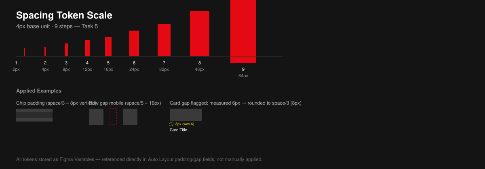

# Task 5 — Spacing Variables & Tokens

A 9-step spacing scale, defined as **Figma Variables** (not just styles), with a 4px base unit. Every padding, gap, and margin used across the component library references one of these tokens rather than a hardcoded pixel value.

## The Scale

| Token | Value | Typical Use |
|---|---|---|
| `space/1` | 2px | Icon-to-badge micro spacing |
| `space/2` | 4px | Base unit; tight internal padding (chip vertical padding) |
| `space/3` | 8px | Icon-to-label gap in buttons; card internal gap |
| `space/4` | 12px | Input internal padding; row item gap |
| `space/5` | 16px | Standard row gap (mobile); component-to-component spacing |
| `space/6` | 24px | Button horizontal padding; tablet row gap |
| `space/7` | 32px | Nav item gap; section-to-section spacing |
| `space/8` | 48px | Desktop grid margin |
| `space/9` | 64px | Section vertical spacing (hero to first row) |

## Where a Real Value Doesn't Land Cleanly on the Scale

Being honest about this rather than silently rounding:

- **Mobile grid margin is 16px** (`space/5`) — this lands cleanly.
- **Tablet grid margin is 24px** (`space/6`) — lands cleanly.
- **Card thumbnail-to-title gap** measured at **6px** in the original Week 3 mockup — this does **not** land on the scale between `space/2` (4px) and `space/3` (8px). Decision: rounded up to `space/3` (8px) rather than introducing a one-off `space/2.5` token, since a half-step token would break the doubling logic the rest of the scale relies on. Documented here rather than silently changed, in case a pixel-perfect handoff later needs to know this was an intentional 2px adjustment.
- **Desktop grid margin** measured at **48px** in the reference layout, which conveniently equals `space/8` — no adjustment needed, but flagged as a coincidence worth double-checking against the actual Netflix reference rather than assuming the scale was reverse-engineered to fit.

## Why Variables, Not Just Styles

Figma **Variables** (as opposed to older Color/Effect Styles) allow these spacing tokens to also be referenced directly inside Auto Layout padding/gap fields, not just applied manually. This means updating `space/5` from 16px to 18px would propagate through every component using it in a single edit — the same reasoning applied to Master Components using shared color variables in Task 1.
