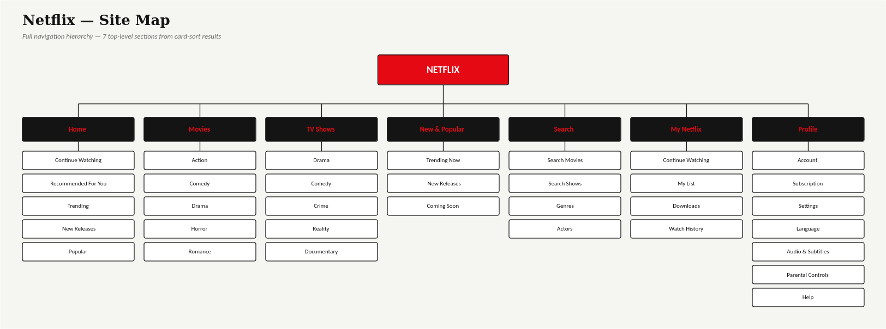

# Site Map

## Diagram


## Hierarchy (text version)

```
Netflix
│
├── Home
│   ├── Continue Watching
│   ├── Recommended For You
│   ├── Trending
│   ├── New Releases
│   └── Popular
│
├── Movies
│   ├── Action
│   ├── Comedy
│   ├── Drama
│   ├── Horror
│   └── Romance
│
├── TV Shows
│   ├── Drama
│   ├── Comedy
│   ├── Crime
│   ├── Reality
│   └── Documentary
│
├── New & Popular
│   ├── Trending Now
│   ├── New Releases
│   └── Coming Soon
│
├── Search
│   ├── Search Movies
│   ├── Search Shows
│   ├── Genres
│   └── Actors
│
├── My Netflix
│   ├── Continue Watching
│   ├── My List
│   ├── Downloads
│   └── Watch History
│
└── Profile
    ├── Account
    ├── Subscription
    ├── Settings
    ├── Language
    ├── Audio & Subtitles
    ├── Parental Controls
    └── Help
```

## Source
This hierarchy is the direct output of the **Final IA Decisions** in [`../Research/Card_Sorting.md`](../Research/Card_Sorting.md) — 7 top-level sections chosen from card-sort agreement scores, with playback-related settings (Language, Audio & Subtitles, Parental Controls) placed under Profile rather than broken out as their own section.

## Notes
- **Continue Watching appears in two places** (Home and My Netflix) by design — it's the single most-used entry point per the earlier research findings ("Continue Watching is the default safety net"), so it's surfaced both on the landing screen and inside the personal-content hub.
- **Search is a top-level section** rather than nested inside Discover/Home, because it needs to be reachable in one tap from anywhere, matching how consistently users treated it as a distinct action in both card sorts.
- **Profile carries the most children (7)** — this is a deliberate trade-off: settings/account items are low-frequency but need one predictable home, rather than being scattered.
