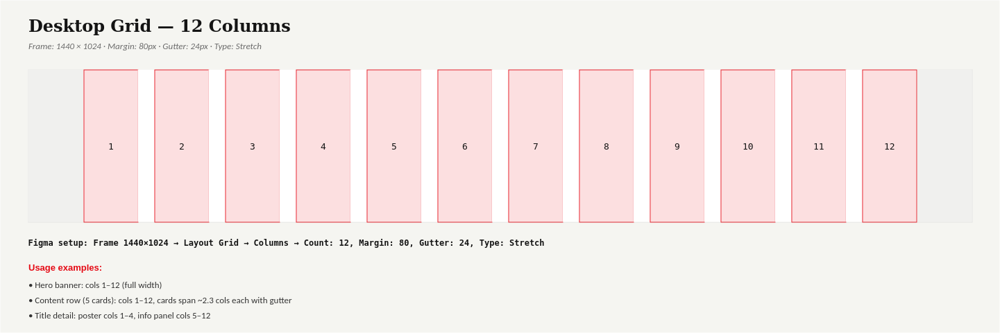
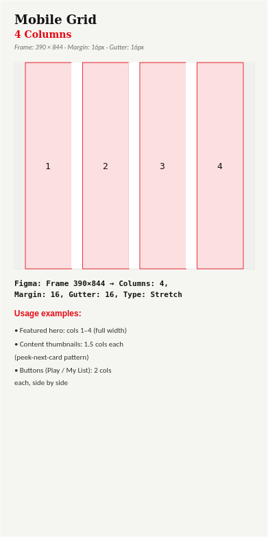

# Layout Grid

## Desktop — 12 Columns


| Parameter | Value |
|---|---|
| Columns | 12 |
| Margin | 80px |
| Gutter | 24px |
| Layout | Stretch |
| Max Width | 1440px design frame |

**Figma setup:** Create a desktop frame at **1440 × 1024**, then `Layout Grid → Columns → Count: 12`, set `Margin: 80`, `Gutter: 24`, `Type: Stretch`.

```
| MARGIN | 1 | 2 | 3 | 4 | 5 | 6 | 7 | 8 | 9 | 10 | 11 | 12 | MARGIN |
```

## Mobile — 4 Columns


| Parameter | Value |
|---|---|
| Columns | 4 |
| Margin | 16px |
| Gutter | 16px |
| Type | Stretch |

**Recommended mobile frame:** 390 × 844.

```
| Margin | 1 | 2 | 3 | 4 | Margin |
```

## Why 12 / 4
- **12 columns (desktop)** divides cleanly into halves, thirds, and quarters — needed for layouts that mix full-width hero sections with split layouts (Movie Details: poster + info panel).
- **4 columns (mobile)** supports both full-width elements (hero, buttons) and the 1.5-column "peek" card pattern used for horizontal-scroll content rows across `../Wireframes/` and `../High_Fidelity_Mockups/`.

## Source
Traces back to card-sort and IA evidence in `../Information_Architecture/Site_Map.md` and the wireframe layouts in `../Wireframes/` — the grid formalizes spacing that was already implicit in those low-fi layouts.
